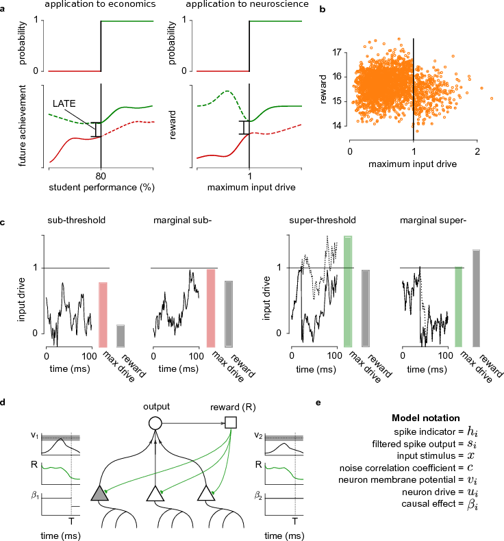

## Neural spiking for causal inference and learning

Ben Lansdell and Konrad Kording 2023

**Abstract:** When a neuron is driven beyond its threshold, it spikes. The fact that it does not communicate its continuous membrane potential is usually seen as a computational liability. Here we show that this spiking mechanism allows neurons to produce an unbiased estimate of their causal influence, and a way of approximating gradient descent-based learning. Importantly, neither activity of upstream neurons, which act as confounders, nor downstream non-linearities bias the results. We show how spiking enables neurons to solve causal estimation problems and that local plasticity can approximate gradient descent using spike discontinuity learning.

`python` code and jupyter notebooks to reproduce figures from our PLOS Computational Biology paper ([here](https://journals.plos.org/ploscompbiol/article?id=10.1371/journal.pcbi.1011005)).

See the text for more details.

