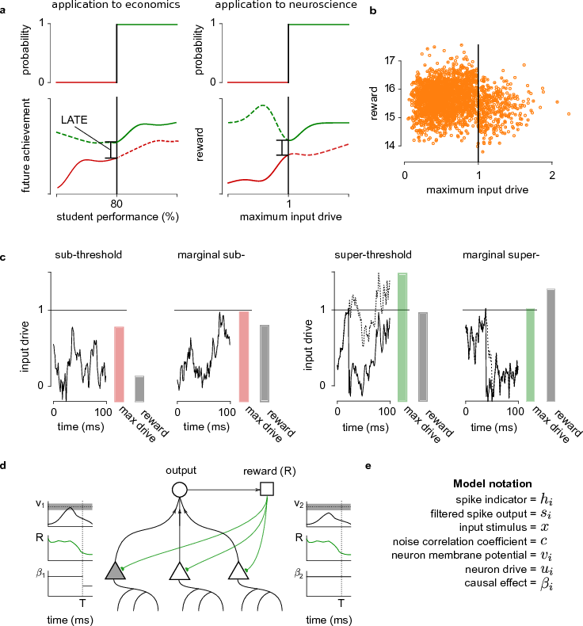

## Neural Spiking For Causal Inference And Learning

Lansdell and Kording 2022

**Abstract:** When a neuron is driven beyond its threshold, it spikes. The fact that it does not communicate its continuous membrane potential is usually seen as a computational liability. Here we show that this spiking mechanism allows neurons to produce an unbiased estimate of their causal influence, and a way of approximating gradient descent-based learning. Importantly, neither activity of upstream neurons, which act as confounders, nor downstream non-linearities bias the results. We show how spiking enables neurons to solve causal estimation problems and that local plasticity can approximate gradient descent using spike discontinuity learning.

`python` code and jupyter notebooks to reproduce figure from our biorxiv preprint ([here](https://www.biorxiv.org/content/early/2018/01/24/253351.article-info)).

See the text for more details.

